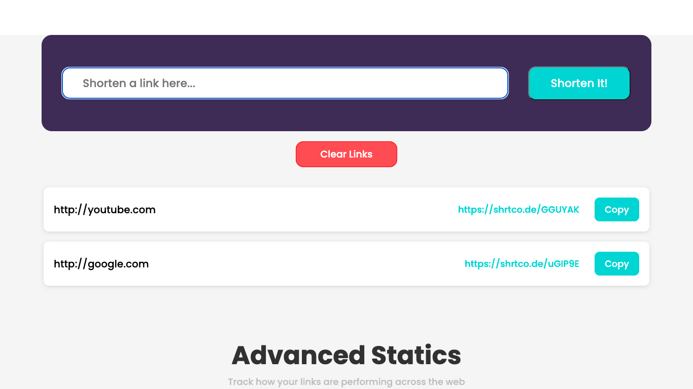

# Angular URL Shortening

## Table of contents

- [Overview](#overview)
  - [The challenge](#the-challenge)
  - [Screenshot](#screenshot)
- [My process](#my-process)
  - [Built with](#built-with)
  - [What I learned](#what-i-learned)
  - [Continued development](#continued-development)
- [Author](#author)

## Overview

This project is a Challenge obtained from the [Frontend Mentor](https://www.frontendmentor.io/) page.

### The challenge

Users should be able to:

- View the optimal layout for the site depending on their device's screen size
- Shorten any valid URL
- See a list of their shortened links, even after refreshing the browser
- Copy the shortened link to their clipboard in a single click
- Receive an error message when the form is submitted if:
    - The input field is empty

### Screenshot

## My process

### Built with

- HTML
- CSS
- Angular framework
- Typescript
- API REST

### What I learned

In this page I learned to implement a complete project with angular, making use of components, services and the implementation of httpClient to subscribe to an api that contained the information to make the url shortening, I also learned to implement a form to put the link which contained a complete validation of the data.

### Continued development

Something that can be implemented in the future is to perform a login or registration to be able to save the links of several users, and integrate them into a database so that each user always knows which links they have previously used.

## Author

Luis David Jimenez Martinez
- Portfolio - [www.luisdavidjm.com](https://www.luisdavidjm.com)
- GitHub - [LuisDavidJM](https://github.com/LuisDavidJM)
